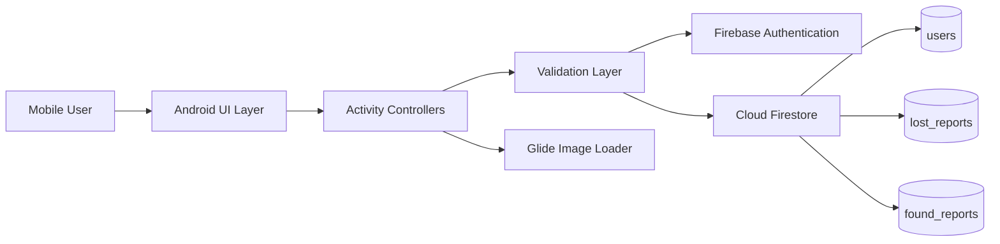
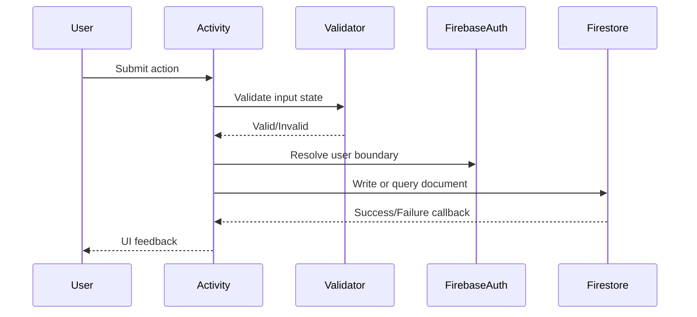

# UniFound


## Abstract

**UniFound** is an Android client application implementing an authenticated, cloud-persisted lost-and-found reporting workflow. The system is structured around a lightweight client-side domain model, Firebase-managed identity, and Firestore-backed document persistence.

The implementation is intentionally scoped as an academic mobile prototype, with emphasis on authenticated access, report consistency, validation, cloud write/read behaviour, and evidence-driven testing.

---

## System Boundary



---

## Core Constraints

| Constraint                               | Implementation Response          |
| ---------------------------------------- | -------------------------------- |
| Reports must persist outside the device  | Firestore document collections   |
| Login must not rely on demo/local logic  | Firebase Authentication          |
| Report timestamps must be consistent     | Server-side timestamping         |
| UI must remain simple under stress usage | Direct action-based navigation   |
| Prototype must remain testable           | Separate lost/found collections  |
| Missing image URLs must not break UI     | Glide placeholder/error fallback |

---

## Technical Axes

| Axis           | Mechanism               | Role                           |
| -------------- | ----------------------- | ------------------------------ |
| Identity       | Firebase Auth           | User account boundary          |
| Persistence    | Cloud Firestore         | Distributed report storage     |
| Client Control | Java Activities         | Event handling and navigation  |
| Presentation   | XML Layouts             | Declarative screen composition |
| Media          | Glide                   | Image resolution and fallback  |
| Verification   | Manual scenario testing | Runtime behaviour validation   |

---

## Logical Decomposition

```text
client/
├── identity/
│   ├── create-account
│   └── login
│
├── report/
│   ├── lost-report-command
│   ├── found-report-command
│   ├── report-query
│   └── item-detail-view
│
├── profile/
│   └── editable-display-state
│
└── infrastructure/
    ├── firebase-auth
    ├── firestore-write
    ├── firestore-read
    └── glide-rendering
```

---

## Firestore Contract

| Collection      | Responsibility             | Required State                  |
| --------------- | -------------------------- | ------------------------------- |
| `users`         | User metadata persistence  | Auth-linked profile information |
| `lost_reports`  | Lost item write/read path  | `status = Lost`                 |
| `found_reports` | Found item write/read path | `status = Found`                |

```java
Map<String, Object> payload = new HashMap<>();
payload.put("status", "Lost");
payload.put("createdAt", FieldValue.serverTimestamp());

FirebaseFirestore.getInstance()
        .collection("lost_reports")
        .add(payload);
```

---

## Runtime Flow



---

## Design Decisions

| Decision                     | Rationale                                                       |
| ---------------------------- | --------------------------------------------------------------- |
| Activity-oriented structure  | Direct mapping between feature screens and implementation units |
| Firebase Auth boundary       | Removes insecure local-only login behaviour                     |
| Separate report collections  | Simplifies prototype query paths and testing evidence           |
| Server timestamps            | Avoids client clock inconsistency                               |
| Explicit validation          | Reduces incomplete document creation                            |
| Trello/MoSCoW/Gantt evidence | Demonstrates controlled scope and staged delivery               |

---

## Quality Gate Matrix

| Gate                | Verification Target                |
| ------------------- | ---------------------------------- |
| Authentication gate | Account creation and valid login   |
| Validation gate     | Invalid/empty form rejection       |
| Persistence gate    | Firestore document creation        |
| Retrieval gate      | Report list population             |
| Navigation gate     | Screen-to-screen workflow          |
| Profile gate        | Edit/display state transition      |
| Build gate          | Android Studio run/build stability |

---

## Extension Surface

```text
future/
├── firebase-storage-upload
├── admin-verification-workflow
├── notification-matching
├── advanced-firestore-querying
├── repository-viewmodel-refactor
└── accessibility-regression-tests
```

---

## Repository Context

```text

type: Native Android coursework prototype
stack: Java + XML + Firebase
owner: ushxyuki
```
